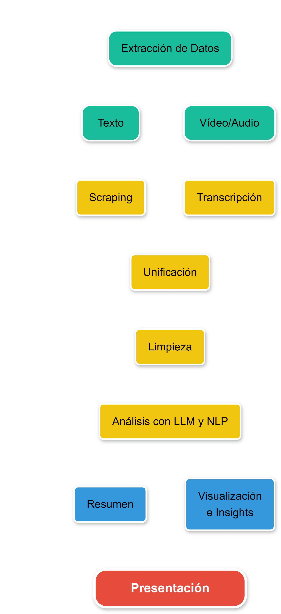
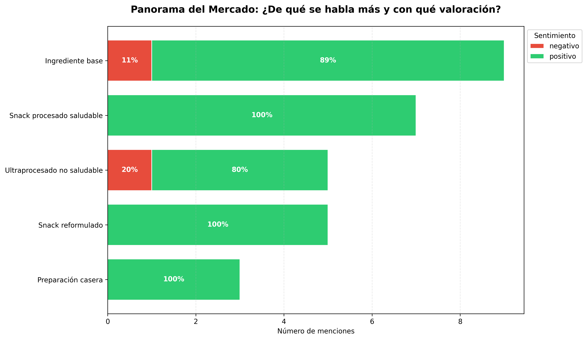
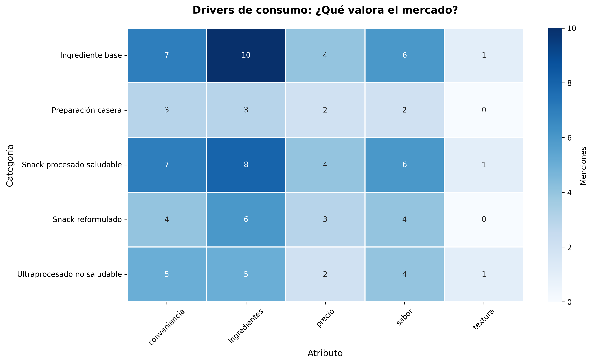
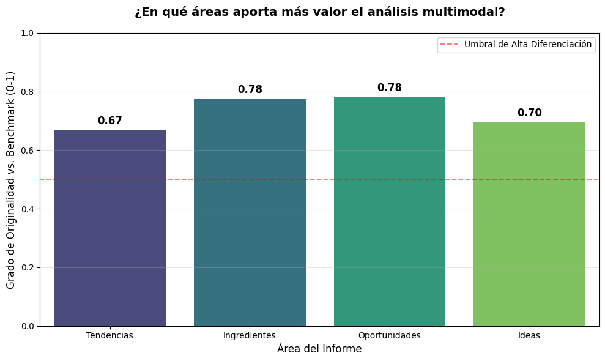
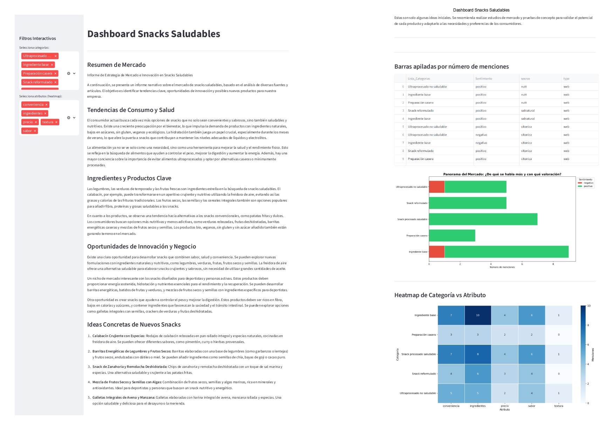

## 0. Introducción.

La empresa Alisense, especializada en el sector de la alimentación, se enfrenta al desafío de desarrollar una nueva línea de **snacks saludables** que conecte de forma efectiva con las preferencias y expectativas del consumidor moderno. Este mercado ha experimentado un crecimiento significativo en los últimos años, impulsado por hábitos de consumo más conscientes de la salud, la digitalización de la información y la creciente influencia de creadores de contenido en redes sociales.

El consumidor actual es cada vez más exigente, está altamente informado y expuesto a múltiples fuentes de opinión. Sin embargo, la información relevante sobre sus percepciones, gustos y motivaciones se encuentra dispersa en artículos, blogs, vídeos, podcasts y contenido generado por usuarios, lo que dificulta su análisis mediante enfoques tradicionales de investigación de mercado.

Con el objetivo de apoyar la toma de decisiones estratégicas y el diseño de esta nueva línea de productos, la compañía ha desarrollado un **análisis multimodal** que combina técnicas de *Machine Learning* y **modelos de lenguaje de gran tamaño (LLM)**. Este enfoque permite sintetizar grandes volúmenes de contenido no estructurado, identificar patrones de consumo y generar *insights* accionables que orienten el desarrollo, la comunicación y el posicionamiento de los nuevos snacks saludables.


## 1. Objetivos

El objetivo general del proyecto es **analizar y sintetizar el comportamiento del consumidor en el contexto de los snacks saludables**, integrando información textual y audiovisual para obtener una visión global del mercado que sirva de apoyo a la innovación de producto.

### Objetivos específicos

* Generar un resumen global del ecosistema de snacks saludables, identificando tendencias de consumo, productos destacados y oportunidades de innovación.

* Determinar los atributos más valorados por los consumidores, tales como sabor, textura, ingredientes, conveniencia, presentación y precio.

* Explorar patrones recurrentes y áreas de oportunidad mediante técnicas de análisis descriptivo y agrupación semántica.

* Aplicar modelos LLM y técnicas de *Machine Learning* para estructurar contenido no organizado y clasificar productos según su tipología.

* Generar visualizaciones claras e interpretables que sinteticen tendencias de sentimiento y atributos prioritarios, facilitando la toma de decisiones estratégicas en el desarrollo de producto.
## 2. Estructura del repositorio
El repositorio está organizado de la siguiente manera:

- `notebooks/`
  - [01_datos.ipynb](notebooks/01_datos.ipynb): Limpieza, extracción y preprocesamiento de datos.
  - [02_modelo_insights.ipynb](notebooks/02_modelo_insights.ipynb): Análisis multimodal, generación de insights y visualizaciones.
  - Se debe añadir `ffmpeg.exe` y `ffprobe.exe` para evitar errores en la transcripción de audio de videos.
- `scripts/`
  - [app.py](scripts/app.py): Script utilizado para visualizar en Streamlit el resultado del resumen y las visualizaciones.
- `data/`: Carpeta con los textos extraidos de las webs y audios con sus transcripciones utilizados en el análisis, así como los datasets procesados y los finalmente obtenidos.
- `imagenes/`: Imágenes utilizadas en este README.md y de visualizaciones del análisis.
- `outputs/`: Resultados generados del análisis multimodal, incluyendo visualizaciones, resúmenes e insights.
- `README.md`: Documentación del proyecto y guía de uso.

## 3. Flujo de trabajo
Este proyecto sigue un flujo de análisis multimodal, desde la extracción y transcripción de fuentes heterogéneas hasta el procesamiento con LLMs, generando resúmenes y visualizaciones interactivas en Streamlit:


## 4. Extracción de datos

El proyecto recopiló información de diversas fuentes relacionadas con **snacks saludables**, combinando datos textuales y audiovisuales para lograr un análisis multimodal más completo.

### Fuentes textuales

Se incluyeron **medios digitales especializados** (Vitónica, InfoRetail, Directo al Paladar) y **blogs profesionales** (Nutt, Sol Natural, Centro Julia Farré). 
La extracción de datos se realizó mediante **scraping combinado de RSS y HTML**: se obtuvieron primero los enlaces desde los feeds RSS y, en caso de no estar disponibles, se parseó la web con `BeautifulSoup` para extraer URLs relevantes.

### Fuentes audiovisuales

Se recopilaron **videos divulgativos, podcasts y contenido corporativo**. Los audios se descargaron mediante `yt_dlp` y se transcribieron con **Whisper**, convirtiendo el contenido audiovisual en texto para su integración en el análisis multimodal.

## 5. Procesamiento de datos

En las fuentes textuales se aplicaron filtros basados en **keywords positivas y negativas**, con el objetivo de conservar únicamente los artículos que aportaban información relevante y descartar aquellos que generaban ruido.

Posteriormente, los datos fueron **limpiados, normalizados y unificados** en un dataset estructurado. Entre las tareas de preprocesamiento se incluyeron:

* Eliminación de duplicados.
* Eliminación de textos demasiado cortos o poco informativos.

Este proceso garantiza que el dataset final sea consistente, de calidad y listo para su análisis multimodal.

## 6. Modelado y generación de insights

Para el modelado se configuró la clave de API y se inicializó un modelo de lenguaje, utilizando **Gemini-2.0-Flash** como modelo principal y **Gemini-1.5-Flash** como respaldo.

Mediante un *prompt* avanzado, el modelo generó un informe ejecutivo que sintetiza tendencias, ingredientes clave, oportunidades de mercado y conceptos de producto. Este informe integra todos los textos previamente limpiados en un único documento coherente, priorizando *insights* diferenciadores, y se guarda como salida final en formato `.txt`.

De forma complementaria, se estructuró el contenido no organizado extrayendo variables como **Producto**, **Atributos** y **Sentimiento**, a través de respuestas en **JSON estrictamente estructurado**, lo que garantiza consistencia en los resultados. La función `procesar_rapido()` aplica el modelo de manera iterativa sobre el dataset, generando un **dataset enriquecido** listo para su análisis.

Adicionalmente, dada la heterogeneidad semántica de los productos mencionados en las distintas fuentes, se empleó el modelo de lenguaje para **clasificar los productos en tipologías de snack** (*Snack procesado saludable, Snack reformulado, Preparación casera, Ingrediente base, Ultraprocesado no saludable, No relevante para snacks*). Esta categorización contextual es clave para interpretar patrones de consumo y construir visualizaciones relevantes.

## 7. Generación del resumen

Como resultado del análisis multimodal, el modelo generó un **informe narrativo de estrategia de mercado e innovación en snacks saludables**, integrando información procedente de fuentes textuales y audiovisuales.

El informe identifica **tendencias clave de consumo**, como la creciente preferencia por snacks saludables, naturales y mínimamente procesados, así como el rechazo progresivo de productos ultraprocesados. Destaca la importancia de ingredientes funcionales y opciones asociadas al bienestar, la nutrición y la conveniencia.

Asimismo, se detectan **oportunidades de innovación**, especialmente en productos orientados a personas activas, control de peso y alternativas saludables a snacks tradicionales. A partir de estos patrones, el modelo propone **ideas de nuevos productos**, proporcionando *insights* accionables para apoyar la toma de decisiones estratégicas en el desarrollo de la nueva línea de snacks.


## 8. Generación de insights y visualización
A partir de los datos estructurados, se generaron:
- **Distribución de Sentimiento Ponderada por Volumen de Menciones**: La distribución de sentimiento evidencia que la conversación se centra principalmente en el **Ingrediente base**, con una valoración mayoritariamente positiva, mientras que los **snacks reformulados** y **procesados saludables** presentan una aceptación plenamente positiva. En contraste, los **ultraprocesados no saludables** concentran el mayor sentimiento negativo, lo que refuerza la existencia de un entorno favorable para la innovación en snacks de perfil saludable y de calidad.

---

- **Mapa de Calor de Atributos Valorados según Tipología de Producto**: Se muestra que los **ingredientes** son el atributo más determinante para el consumidor, especialmente en la categoría de **Ingrediente base** y en los **snacks procesados saludables**, seguidos por **conveniencia** y **sabor** como principales motores de compra. En contraste, atributos como **precio** y **textura** tienen menor relevancia, lo que sugiere que el mercado prioriza la calidad y la facilidad de consumo frente al coste, orientando la innovación hacia productos con composición cuidada y buen sabor.


## 9. Evaluación del proyecto
Para evaluar el rendimiento del modelo, se generaron **20 resúmenes de referencia** con distintos enfoques y se analizaron por secciones (tendencias, ingredientes, oportunidades e ideas). Los resultados muestran que **Ingredientes** y **Oportunidades** son las áreas más diferenciadoras, seguidas por **Ideas**, mientras que **Tendencias** presenta menor originalidad al alinearse con patrones de mercado ya conocidos. En conjunto, el análisis confirma que el informe aporta *insights* diferenciales y valor estratégico para la innovación en snacks saludables.



## 10. Ejecución

Para facilitar la exploración de los resultados por parte del equipo, se desarrolló una **interfaz de visualización con Streamlit**, que permite acceder de manera sencilla y dinámica a los análisis, gráficos y *insights* generados.

### Instrucciones de ejecución

1. Instalar Streamlit si no está disponible:
```bash
pip install streamlit
```
2. Posicionarse en la carpeta de scripts del repositorio:
```bash
cd scripts
```
3. Ejecutar la aplicación
```bash
streamlit run app.py
```

### Resultado


## 11. Conclusiones
Aunque el proyecto logró extraer y analizar un amplio volumen de información, existen ciertas limitaciones: algunos medios generalistas tuvieron que descartarse porque no permitían hacer *scraping*, y en las fuentes utilizadas puede haberse perdido parte del contexto. Por su parte, las fuentes audiovisuales aportan un gran valor, pero las transcripciones automáticas no son perfectas y el procesamiento requiere tiempo considerable.

Aun así, los resultados permiten dibujar un panorama claro del mercado: aunque la conversación del consumidor gira principalmente en torno a los **ingredientes**, los **snacks reformulados** y **procesados saludables** reciben valoraciones muy positivas, mientras que los **ultraprocesados no saludables** generan rechazo. Esto confirma que existe un interés real por productos que combinen **salud, sabor y calidad**.

En conjunto, el proyecto ofrece **insights estratégicos y accionables** que ayudan a guiar decisiones sobre desarrollo de producto, comunicación y posicionamiento en el mercado de snacks saludables.

### Posibles mejoras
- Integrar un mayor volumen de fuentes y **datos de redes sociales en tiempo real**, para captar tendencias emergentes y cambios en la percepción del consumidor.  
- Implementar **modelos LLM adicionales**, incluyendo análisis multilingüe, para enriquecer los insights y descubrir oportunidades que podrían pasar desapercibidas con un único modelo.
